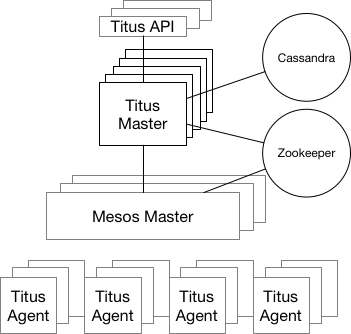

Titus is a container management platform that provides scalable and reliable container execution and
cloud-native integration with Amazon AWS.

## Background

Titus was built internally at Netflix and is used in production
to power Netflix streaming, recommendation, and content systems. Titus development began in 2015 when the
container management space was still nascent and with a focus on Netflix scale, reliability, and tight
integration with Amazon AWS and other Netflix systems, both OSS and internal.

Titus aims to enable easy and reliable deployment of containerized batch and service applications.
Achieving this goal requires:

- Allowing containerized applications to seamlessly interact with AWS, Netflix, and other cloud services.
Interactions with other systems should not be an application burden simply because it is running in a container.
- Operability to ensure the system is capable of running mission critical workloads and meeting SLAs.
- Scalability to run tens of thousands of containers on top of thousands of hosts across a variety of use cases.

## Architecture

Titus is a framework on top of Apache Mesos, a cluster-management system that brokers
available resources across a fleet of machines. Titus consists of a replicated, leader-elected scheduler
called Titus Master, which handles the placement of containers onto a large pool of EC2 virtual machines
called Titus Agents, which manage each container's life cycle. Zookeeper manages leader election, and
Cassandra persists the master's data.  The Titus architecture is shown below.

Work in Titus is described by a job specification that details what to run
(e.g., a container image and entry point), metadata (e.g., the job's purpose and who owns it), and
what resources are required to run it, such as CPU, memory, or scheduling constraints (e.g., availability
zone balancing or host affinity). Job specifications are submitted to the master and consist of a
number of tasks that represent an individual instance of a running application. The master schedules
tasks onto Titus agents that launch containers based on the task's job specification.

### Components

#### Titus Gateway
The Titus Gateway is a scalable API tier that handles direct requests from clients and users. The Gateway exposes gRPC
 and REST APIs, handles connection management, and performs validation.
 
 
#### Titus Master
The Titus Master is responsible for persisting job and task information, scheduling tasks, and managing the
 pool of EC2 Agents. The Master receives requests from Gateway instances and creates and persists job and task info
 in response. The Master schedules tasks onto Agents with available resources and scales the pool of Titus Agents
 up or down in response to demand.
 
 
#### Titus Agent
Titus Agents are responsible for setting up and running task containers and managing their lifecycle. The Agent
 sets up on host resources, such as storage and networking resources, and launches the container using Docker. The
 Agent monitors the task, reporting status and cleaning up resources when it completes.